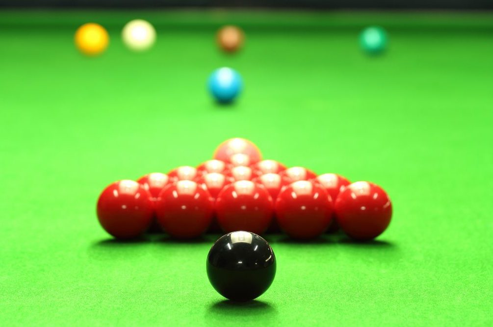
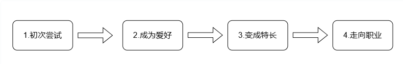

我把斯诺克当什么？
——从兴趣到特长，再到职业
拿起球杆，站到球桌前亲身试一试。感受手握球杆击打母球，借由母球撞击目标球入袋这项运动，看自己是否感兴趣。如果产生了这份兴趣，恭喜你，你可以一直玩下去，持续享受这项运动带来的乐趣。

摸清基础玩法，多打一段时间，再来看看自己有没有天赋。愿意沉下心刻苦训练，日积月累之后，就可以练出不错实力，把斯诺克打磨成一项特长，成为广大爱好者里那十分之一的高手。

如果你向往更高强度的对抗与心理较量，希望以斯诺克博取名利，成为千万分之一，那么走上职业道路是最佳选择。

身份有别，水平各异。享受斯诺克乐趣，体会击打与控制的独特魅力，在以上4个阶段都能实现。

本文版权协议为 CC-BY-NC-ND license

